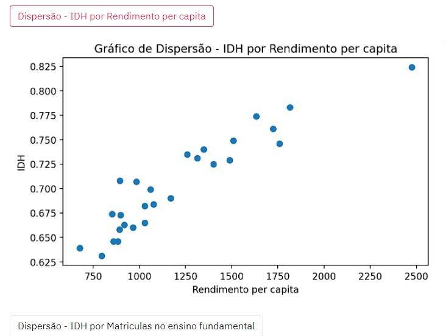

<h4 align="center"> 
Web Scraping em Python + Streamlit
  
(Em andamento 🚧)
	


</h4>


##

### Sobre o projeto 💻

Desenvolvimento de uma ferramenta simples para extrair dados do IBGE e realizar algumas análises. É um projeto com fins educacionais, para aprender e colocar em prática novas habilidades.

##

### Imagens

#### Tela inicial
 
 
#### Análises geradas
 
 


##

### Instalação

 Este projeto requer Python na versão 3.8 e as seguintes bibliotecas:
- [NumPy](http://www.numpy.org/)
- [Pandas](http://pandas.pydata.org/)
- [matplotlib](http://matplotlib.org/)
- [BeautifulSoup](https://www.crummy.com/software/BeautifulSoup/bs4/doc/)
- [requests](http://docs.python-requests.org/en/master/)
- [seaborn](https://seaborn.pydata.org/installing.html/)
- [base64](https://docs.python.org/pt-br/3.7/library/base64.html)
- [streamlit](https://docs.streamlit.io/en/stable/)

##

### Rodando a aplicação

Em um terminal, vá até o diretório onde está localizado o projeto/script e execute o seguinte comando:
```bash
streamlit run webscraping_streamlit.py
```
Em seguida, uma guia será aberta já rodando a aplicação.

## 

### Autor

| [<br>](https://github.com/lucasmendoncca)|
| :---: |
<a href = "mailto:lucas.souza4213@gmail.com"></a>
